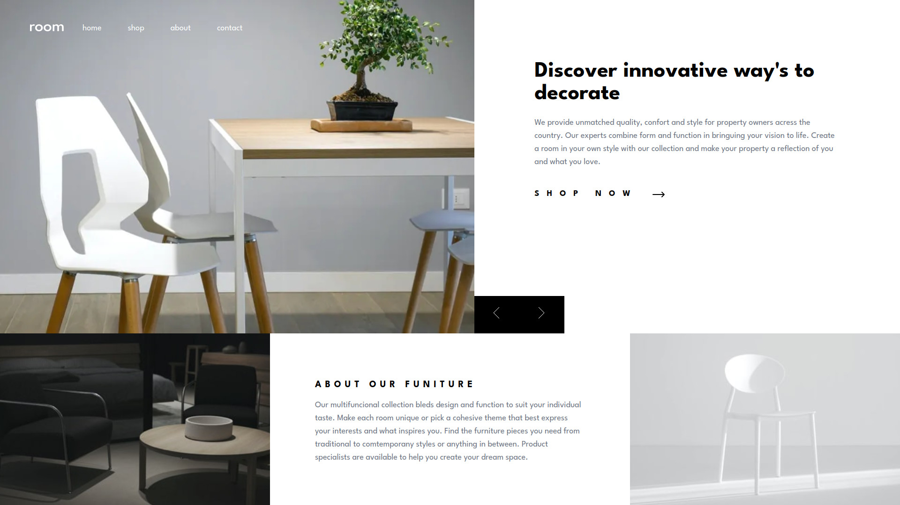

# Frontend Mentor - Room homepage solution

This is a solution to the [Room homepage challenge on Frontend Mentor](https://www.frontendmentor.io/challenges/room-homepage-BtdBY_ENq). Frontend Mentor challenges help you improve your coding skills by building realistic projects.

## Table of contents

- [Overview](#overview)
  - [The challenge](#the-challenge)
  - [Screenshot](#screenshot)
  - [Links](#links)
- [My process](#my-process)
  - [Built with](#built-with)
  - [What I learned](#what-i-learned)
  - [Continued development](#continued-development)
  - [Useful resources](#useful-resources)
- [Author](#author)
- [Acknowledgments](#acknowledgments)

**Note: Delete this note and update the table of contents based on what sections you keep.**

## Overview

### The challenge

Users should be able to:

- View the optimal layout for the site depending on their device's screen size
- See hover states for all interactive elements on the page
- Navigate the slider using either their mouse/trackpad or keyboard

### Screenshot

### Links

- Solution URL: [Add solution URL here](https://github.com/ttsoares/room-homepage)
- Live Site URL: [Add live site URL here](https://room-homepage-ochre-delta.vercel.app/)

## My process

### Built with

- [React](https://reactjs.org/) - JS library
- [Next.js](https://nextjs.org/) - React framework
- [React Hotkeys](https://www.npmjs.com/package/react-hotkeys-hook) - A React hook for using keyboard shortcuts in components in a declarative way.
- [TW-Animated](https://www.npmjs.com/package/tailwindcss-animated) - Extended animation utilities for Tailwind CSS

### What I learned

- Had to build the burger menu from scratch as this one is horizontal...
- Learned to use the React libs to handle keyboard and animations.

### Continued development

Still have been ding to much try_and_error to build the CSS infrastructure with Tailwind.

### Useful resources

- The icons SVG usually included in the challenges do not follow the text color defined in the container where they are. I'v been using the ones there:
  [TW Icons](https://heroicons.com/) - Icons more Tailwind friendly.

- Also, the <Image/> tag from NextJS, when used with SVGs, pose some difficulties...

## Author

- Website - [Thomas Tschoepke Soares](https://www.linkedin.com/in/thomas-soares-6791781b/)
- Frontend Mentor - [@ttsoares](https://www.frontendmentor.io/profile/ttsoares)

## Acknowledgments

Several very useful Youtube videos from nice persons helping the IT community...
